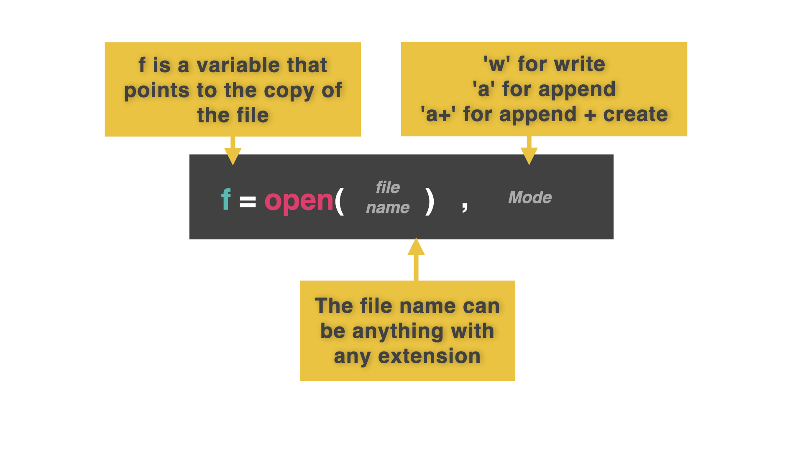
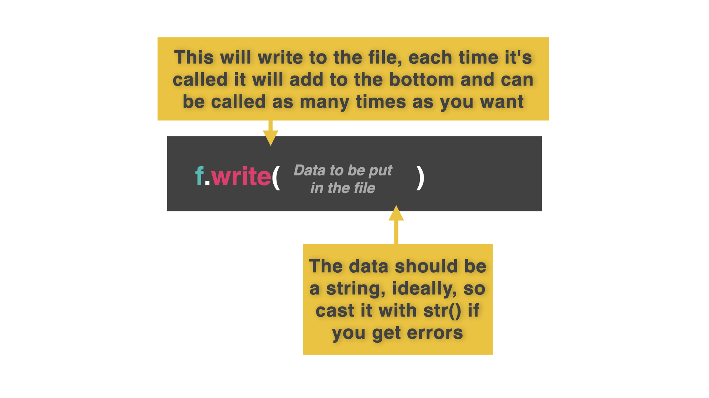
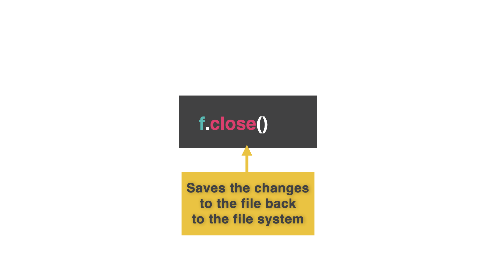
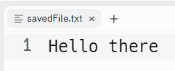

# File Writing

Our repls don't need to be just one file that contains all of the code and data.  We can write data to other files for longer term storage, then access it when we need it.

👉 To do this we're going to use the **Files** tab in the left hand toolbar.  It looks like this:


## Temporary Memory

When we use variables, lists, dictionaries and other data structures in our code, the data inside them are stored in the computer's RAM.

RAM is *temporary* storage (usually called memory).  It's used to hold data and instructions for programs that your computer currently has open.

The problem is, that when a program finishes, or is closed, its data and instructions are removed from the RAM to free up space.

This is why you had to re-input all of your test data for your dynamic list & dictionary programs every time you ran them.  The contents of those lists/dictionaries were removed from RAM when the program finished executing.


## Creating A New File

To avoid this incredibly annoying data re-entry task, we are going to get the program to save data into a file. The file will exist in *secondary* storage (the hard drives on Replit's servers in this case). 

👉 Here's how to open a file. This one line of code has **three** important features:

```python
f = open("savedFile.txt", "w")
```



1. **The variable (`f`):** This is needed to allow your program to communicate to the file. Normally this would have a lovely meaningful name. However, you will need to type this variable name lots, and lots, and lots. So short is good. 'f' is short for 'file'.


2. **The file name (the first item in brackets, `"savedFile.txt"`):**  You **MUST** code this to match the filename **EXACTLY** and include the file extension.
3. **The 'w' (second item in brackets):** This sets the permissions for the file. 'w' means 'write'. This means that if the file doesn't already exist, the program will create a new blank file with that file name.  However, if it **does** already exist it will be overwritten with a blank file.


## Save Me! Writing Data To The File

👉 The `.write()` command will write the piece of data in brackets into the file.
You can use as many of these as you want.

```python
f = open("savedFile.txt", "w")
f.write("Hello there")

```

## Close
👉 However, this data **IS STILL IN THE RAM**. Nothing gets saved until we close the file using the `.close()` command.


```python
f = open("savedFile.txt", "w")
f.write("Hello there")
f.close()
```

When you run this code, nothing will appear in the console, but check the files tab on the left.

*Gasp!* A file has been created. 


Click on it to view the contents!



### Try it out and get writing!